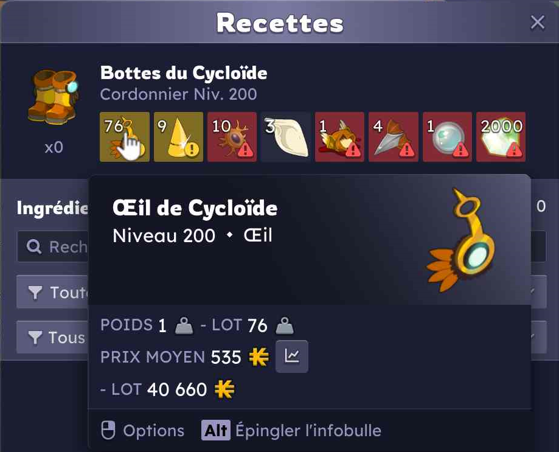
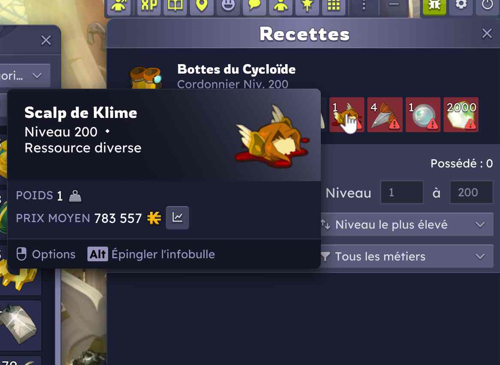

# Scripts AutoHotkey pour Dofus

## Table des matières

- [⚠️ Avertissement](#avertissement)
- [Prérequis](#prerequis)
- [Installation](#installation)
  - [Lancer un script au démarrage](#lancer-un-script-au-demarrage)
- [Organisation des scripts](#organisation-des-scripts)
- [Personnaliser les raccourcis](#personnaliser-les-raccourcis)
- [`grouping.ahk` — invitation de groupe](#groupingahk)
- [`travel.ahk` — déplacement via zaap](#travelahk)
- [`multi_account.ahk` — gestion multi-compte](#multi_accountahk)
- [`recipe_price.ahk` — calcul de prix de recette](#recipe_priceahk)
  - [Fichier de support : `ocr_utils.ahk`](#ocr_utilsahk)
  - [Calibration (`Ctrl+Maj+R`)](#calibration)

<a id="avertissement"></a>
## ⚠️ Avertissement

Plusieurs de ces scripts automatisent des actions dans le jeu (lecture des fenêtres ouvertes, envoi de commandes, répétition de clics, lecture de texte à l'écran) sur un ou plusieurs comptes à la fois. Les CGU d'Ankama interdisent l'usage de bots ou de toute automatisation remplaçant une action humaine ou donnant un avantage compétitif. Les raccourcis marqués ⚠️ dans les sections ci-dessous effectuent **plusieurs actions automatiques d'affilée, ou la même action sur plusieurs fenêtres à la fois**, et sont donc les plus susceptibles d'être considérés comme de l'automatisation au sens des CGU. Utilisez-les en connaissance de cause et à vos propres risques.

<a id="prerequis"></a>
## Prérequis
- [AutoHotkey v2](https://www.autohotkey.com/)
- [Bibliothèque OCR](https://github.com/Descolada/OCR) (à installer dans le dossier `Autohotkey/Lib`, nécessaire uniquement pour `recipe_price.ahk`). Pour plus d'information regardez sur la documentation officielle [ici](https://www.autohotkey.com/docs/v2/Scripts.htm#lib)

<a id="installation"></a>
## Installation
- Clonez le dépôt, téléchargez les scripts individuellement, ou copiez-collez directement les fonctions dont vous avez besoin dans un fichier `.ahk`
- Double-cliquez sur un script pour le lancer et l'essayer

<a id="lancer-un-script-au-demarrage"></a>
### Lancer un script au démarrage
- Faites un clic droit sur le script voulu, puis "Créer un raccourci"
- "Coupez" le raccourci (`Ctrl+X` ou clic droit -> Couper)
- Appuyez sur `Win+R`
- Tapez `shell:startup`
- Collez le raccourci dans le dossier

<a id="personnaliser-les-raccourcis"></a>
## Personnaliser les raccourcis

Si un raccourci par défaut ne vous convient pas, chacun est une simple variable dans la section `;; CONFIGURATION` en haut du fichier concerné, par exemple dans `travel.ahk` :

```ahk
travelShortcut := "^y"
```

Il suffit de modifier la valeur entre guillemets. Les scripts utilisent la syntaxe de touches d'AutoHotkey :
- `^` = Ctrl
- `+` = Maj (Shift)
- `!` = Alt
- `#` = touche Windows
- Les modificateurs se combinent en les accolant, ex. `^+y` = Ctrl+Maj+Y

La liste complète des noms de touches valides (touches de fonction `F1`-`F24`, flèches, pavé numérique, boutons de la souris, etc.) est disponible dans la [documentation officielle des touches AutoHotkey](https://www.autohotkey.com/docs/v2/KeyList.htm).

⚠️ Deux raccourcis identiques définis dans le même script entrent en conflit : un seul des deux fonctionnera réellement, sans message d'erreur. Vérifiez qu'une touche n'est pas déjà utilisée ailleurs dans le même fichier avant de l'assigner.

Après toute modification, il faut recharger le script pour qu'elle prenne effet (clic droit sur son icône dans la barre des tâches -> "Reload This Script", ou relancez-le) : AutoHotkey ne recharge pas automatiquement un fichier modifié pendant qu'il tourne.

Certains scripts définissent aussi des listes (`Map`) plutôt qu'un simple raccourci, pour associer plusieurs raccourcis à des données différentes :
- `namedLocations` dans `travel.ahk` : associe un nom de lieu à des coordonnées et, en option, un raccourci dédié qui y téléporte directement
- `characterShortcuts` dans `multi_account.ahk` : associe un raccourci à une liste de noms de personnages

Pour ajouter une entrée, copiez une ligne existante et adaptez-la, par exemple dans `multi_account.ahk` :

```ahk
characterShortcuts := Map(
    "F5", ["Cal-Vioc", "Cal-Ice", "Cal-eidoscope"],
    "F6", ["Cal-Ori", "Cal-Siner"],
    "F7", ["MonNouveauPersonnage"]
)
```

---

<a id="groupingahk"></a>
## `grouping.ahk` — invitation de groupe

| Raccourci par défaut | Action |
|---|---|
| `Ctrl+G` | Invite dans le groupe tous les autres personnages Dofus actuellement ouverts |

Le script lit le titre de chaque fenêtre Dofus ouverte (format `NOM - CLASSE - VERSION - TYPE`), construit une commande `/invite Nom1; /invite Nom2; ...` en excluant le personnage actif, la copie dans le presse-papiers puis l'envoie dans le chat de la fenêtre active.

---

<a id="travelahk"></a>
## `travel.ahk` — déplacement via zaap

| Raccourci par défaut | Action |
|---|---|
| `Ctrl+Y` | Demande des coordonnées (ou le nom d'un lieu enregistré), calcule le zaap le plus proche et envoie `/zaap X Y; /travel x y` dans la fenêtre active |
| `Ctrl+Maj+Y` ⚠️ | Identique à `Ctrl+Y`, mais envoie la commande dans **toutes** les fenêtres Dofus actives |
| `Ctrl+Maj+C` ⚠️ | Envoie le contenu actuel du presse-papiers dans **toutes** les fenêtres Dofus actives, sans rien demander |
| `Ctrl+Maj+V` | Envoie le contenu actuel du presse-papiers uniquement dans la fenêtre active |

Des lieux nommés peuvent être définis dans `namedLocations` (section CONFIGURATION), avec des coordonnées et, en option, un raccourci dédié qui y téléporte directement sans passer par la fenêtre de saisie. La liste des zaaps utilisée pour trouver le plus proche vient de `data/zaaps.yaml`.

⚠️ **Les raccourcis qui diffusent une commande sur toutes les fenêtres ouvertes appliquent la même action à plusieurs comptes en une seule pression de touche.**

---

<a id="multi_accountahk"></a>
## `multi_account.ahk` — gestion multi-compte

| Raccourci par défaut | Action |
|---|---|
| `F2` | Passe à la fenêtre Dofus suivante |
| `F3` | Clique à la position actuelle de la souris, puis passe à la fenêtre Dofus suivante |
| `F4` ⚠️ | Démarre/arrête l'enregistrement des clics sur la fenêtre active ; à l'arrêt, **rejoue automatiquement la séquence de clics enregistrée sur toutes les autres fenêtres Dofus ouvertes** |
| Raccourcis définis dans `characterShortcuts` (ex. `F5`, `F6`) | Bascule directement vers la fenêtre du personnage correspondant si elle est ouverte, sans rien faire sinon |

⚠️ **`F4` automatise une séquence de clics identique sur l'ensemble de vos comptes sans intervention manuelle entre chacun — c'est l'usage le plus proche d'un bot parmi ces scripts.**

---

<a id="recipe_priceahk"></a>
## `recipe_price.ahk` — calcul de prix de recette

| Raccourci par défaut | Action |
|---|---|
| `Ctrl+P` ⚠️ | Calcule automatiquement le prix total d'une recette en déplaçant la souris et en lisant par OCR le prix moyen de chaque ingrédient, l'un après l'autre |
| `Ctrl+Maj+P` | Identique à `Ctrl+P`, mais affiche les étapes de détection (mode debug) |
| `Ctrl+U` | Ajoute un prix détecté à un cumul manuel ; repasser sans détection affiche le total et le réinitialise |
| `Ctrl+Maj+U` | Détecte un seul prix, en mode debug |
| `Ctrl+Maj+R` | Assistant de calibration en 4 étapes (voir ci-dessous) |

⚠️ **`Ctrl+P` déplace la souris et enchaîne plusieurs lectures automatiques sans intervention manuelle entre chaque ingrédient.**

<a id="ocr_utilsahk"></a>
### Fichier de support : `ocr_utils.ahk`

`recipe_price.ahk` s'appuie sur `ocr_utils.ahk` pour tout ce qui touche à l'OCR : c'est un fichier de support inclus par `recipe_price.ahk` (comme `utils.ahk`), pas un script à lancer seul. Il regroupe deux choses :

- La détection de la ligne "PRIX MOYEN" à l'écran (`FindPrixMoyenLine` / `FindPrixMoyenLineInRect`), utilisée par `recipe_price.ahk` à chaque lecture de prix.
- L'assistant de calibration déclenché par `Ctrl+Maj+R` (`CalibrateRecipeSetup`), décrit ci-dessous, qui mesure les 3 valeurs dont `recipe_price.ahk` a besoin en vous faisant dessiner des rectangles à la souris plutôt que de les régler à la main.

Vous n'avez normalement jamais besoin d'ouvrir ce fichier : passez par `Ctrl+Maj+R` dans `recipe_price.ahk`.

<a id="calibration"></a>
### Calibration (`Ctrl+Maj+R`)

Les valeurs `ingredientStepPx`, `searchAreaOffset` et `priceAreaPadding` (section CONFIGURATION de `recipe_price.ahk`, clairement isolées et commentées) dépendent de la résolution d'écran et de la taille de la fenêtre Dofus. Plutôt que de les régler à la main, `Ctrl+Maj+R` lance un assistant en 4 étapes, chacune illustrée par une image de référence (dossier `data/`) :

1. Dessinez un rectangle englobant les 2 premiers ingrédients de la recette, pour mesurer l'espacement entre eux (`ingredientStepPx`, la moitié de la largeur du rectangle).
2. Positionnez la souris comme pour vérifier un prix normalement (infobulle ouverte, `Alt` pour la verrouiller), puis cliquez pour enregistrer cette position de référence. Cette étape ne bloque pas les clics vers Dofus, pour que l'infobulle du jeu s'affiche normalement.
3. Dessinez un rectangle couvrant toute la zone où l'infobulle de prix apparaît (`searchAreaOffset`, mesuré par rapport à la position enregistrée à l'étape précédente). **Prévoyez large** : l'infobulle n'apparaît pas toujours exactement au même endroit par rapport à la souris, par exemple :

   
   

4. Dessinez un rectangle autour de l'endroit où le prix moyen doit être lu (`priceAreaPadding`, calculé par rapport à la position de "PRIX MOYEN" détectée par OCR). **Prévoyez large également** : un prix élevé prend plus de place à l'écran qu'un petit prix.

Les étapes 1, 3 et 4 se font sur une surface transparente qui recouvre tout l'écran, pour que le clic-glissé ne soit jamais transmis au jeu en dessous. `Échap` annule l'étape en cours. Les nouvelles valeurs s'appliquent immédiatement pour la session en cours ; à la fin, une zone de texte **sélectionnable** affiche les 3 lignes à copier dans la section CONFIGURATION de `recipe_price.ahk` pour les rendre permanentes.
